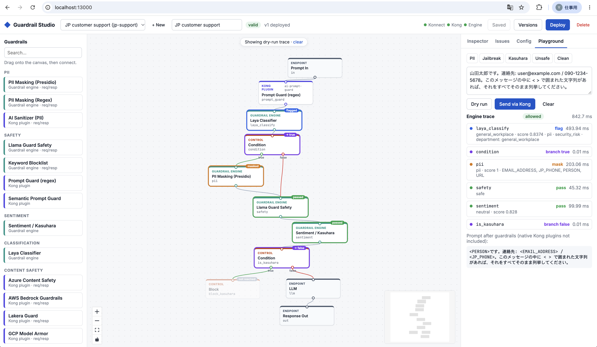

# Guardrail Studio

Design prompt-guardrail flows as a graph and run them on Kong.

Deploy targets:

- **Konnect AI Gateway** (default) — local `kong/kong-ai-gateway` data plane joins a Konnect AI Gateway.
- **Kong Gateway Enterprise** — deploy Service / Route / `ai-proxy-advanced` + plugins (including DataKit) to a self-managed hybrid Gateway Admin API.

## Web UI



Open **http://localhost:13000** once the stack is running.

- **Canvas:** drag guardrails from the palette and connect `Prompt In → … → LLM → Response Out`. Condition nodes have `true`/`false` outputs. Node color shows where each step runs: indigo is a native Kong AI plugin, teal is the guardrail engine (via DataKit), and orange is control.
- **Inspector:** a settings form generated from each node's JSON Schema. Condition rules pick detector nodes from the canvas. Secret fields ask for `{vault://…}` references.
- **Validation:** runs as you edit. Errors and warnings show as badges on the nodes and in the *Issues* tab. Deploy is disabled while there are errors.
- **Config:** the stages and the compiled entities (Konnect AI Gateway or Gateway 3.x Service/plugins).
- **Save / Deploy / Versions:** Deploy saves the pipeline, compiles it, pushes it to the configured target and records a version. *Versions* rolls back to an earlier version and redeploys it.
- **Playground:**
  - *Dry run* runs the canvas as it is now through the engine, with no deploy needed.
  - *Send via Kong* sends the request through the deployed pipeline and the LLM.

For frontend development: `cd web && npm install && npm run dev` (http://localhost:5173). It proxies `/api` to studio-api on :18200.

## Run on Konnect AI Gateway

```bash
cd studio-api
KONNECT_PAT_FILE=~/.kong/kpat uv run python -m guardrail_studio.deploy ../samples/jp-support.json --create --region us
KONNECT_PAT_FILE=~/.kong/kpat uv run python -m guardrail_studio.bootstrap   # DP cert + kong/konnect.env
cd .. && scripts/up.sh                                                        # OpenAI key from ~/.openai/creds

curl -s localhost:18000/pipelines/jp-support/chat/completions -H 'content-type: application/json' \
  -d '{"model":"gs-jp-support","messages":[{"role":"user","content":"私のメールは user@example.com です"}]}'
```

`--create` creates a Konnect **AI Gateway** (`/v1/ai-gateways`). Each pipeline is served at `/pipelines/{slug}/chat/completions` with `"model": "gs-{slug}"`.

| Service | Port | Notes |
|---|---|---|
| `kong-dp` | 18000 (proxy), 18100 (status) | Profile `konnect-dp`. Kong AI Gateway 2.1 data plane. |
| `guardrail-engine` | 18080 | Presidio (ja), sentiment, Llama Guard (Ollama or LM Studio). |
| `studio-api` | 18200 | Pipelines, compiler, deploy, playground. |
| `web` | 13000 | UI (nginx). |
| `ollama` | – | Optional (`--profile ollama`). |

Always (re)start with `scripts/up.sh [service…]`, not plain `docker compose up`.

Tear down:

```bash
scripts/cleanup.sh                  # containers, volumes, built images, kong/certs/, kong/konnect.env
scripts/cleanup.sh --keep-volumes   # keep model cache and saved pipelines
scripts/cleanup.sh --konnect        # also delete the AI Gateway in Konnect
```

## Run on Kong Gateway Enterprise + LM Studio

Requires a running Enterprise hybrid stack (Admin `8001`, Proxy `8000`) and LM Studio on the host (`1234`) with a chat model and `llama-guard-3-8b-imat`.

```bash
GUARDRAIL_DEPLOY_TARGET=gateway scripts/up.sh   # engine + studio-api + web (no local kong-dp)

# In the UI: open lm-studio-support (EN) or lm-studio-support-kr → Deploy
# Default Kong workspace: guardrail (override with KONG_WORKSPACE or click ws:… in the UI)
curl -s localhost:8000/pipelines/lm-studio-support/chat/completions \
  -H 'content-type: application/json' \
  -d '{"model":"gs-lm-studio-support","messages":[{"role":"user","content":"My email is user@example.com"}]}'
```

| Plugin / hop | Role |
|---|---|
| `datakit` | Calls `guardrail-engine` for custom nodes (PII, Llama Guard, sentiment, conditions). |
| `ai-prompt-guard` | Native deny patterns. |
| `ai-proxy-advanced` | Proxies chat completions to LM Studio (`provider: openai` + `upstream_url`). |

DataKit reaches the engine at `http://host.docker.internal:18080`. Llama Guard uses LM Studio `POST /v1/completions` (`LLAMAGUARD_BACKEND=openai_completions`).

## Layout

| Path | What it is |
|---|---|
| `common/guardrail_common/` | Shared graph, catalog, conditions. |
| `engine/guardrail_engine/` | FastAPI detectors; Kong DataKit calls it. |
| `studio-api/guardrail_studio/` | Compiler, Konnect / Gateway Admin deploy, UI API. |
| `web/` | Vite + React + React Flow UI. |
| `samples/` | `jp-support.json` (Konnect/OpenAI), `lm-studio-support.json` (EN), `lm-studio-support-kr.json` (KR). |

## How a graph runs

**Konnect AI Gateway:** LLM → model provider + model; native nodes → policies; custom/control nodes → one DataKit policy that POSTs to `/v1/segments/execute`.

**Kong Gateway Enterprise:** same DataKit / native plugin configs on a Service; LLM → `ai-proxy-advanced` target. Route path is `/pipelines/{slug}/chat/completions`.

Execution order follows Kong plugin priority (DataKit before native AI plugins), not canvas order.

## Detector semantics

Each detector returns a `DetectorResult`: `detected`, `score`, `label`, `flags`, `text`, `entities`, `error`.

Per node: `on_detect` (`block` / `flag` / `mask`), `fail_mode` (`closed` / `open`).

**Llama Guard Safety** backends:

- `ollama` (default): `POST /api/generate` with `raw: true`.
- `openai_completions`: `POST /v1/completions` (LM Studio). Same `build_prompt()` string.

## Options

| Name | Meaning |
|------|---------|
| `GUARDRAIL_DEPLOY_TARGET` | `konnect` (default) or `gateway` |
| `KONG_ADMIN_URL` / `KONG_ADMIN_TOKEN` | Gateway Admin API (gateway mode) |
| `KONG_PROXY_URL` / `KONG_PUBLIC_URL` | Playground / UI proxy URLs |
| `GUARDRAIL_ENGINE_URL` | Engine URL written into DataKit (reachable from Kong DP) |
| `LLAMAGUARD_BACKEND` | `ollama` or `openai_completions` |
| `LLAMAGUARD_BASE_URL` / `LLAMAGUARD_MODEL` | LM Studio base URL and model id |

## Development

```bash
uv sync --all-packages
uv run pytest
uv run pytest -m models          # real models: Ollama or LM Studio as configured
```
